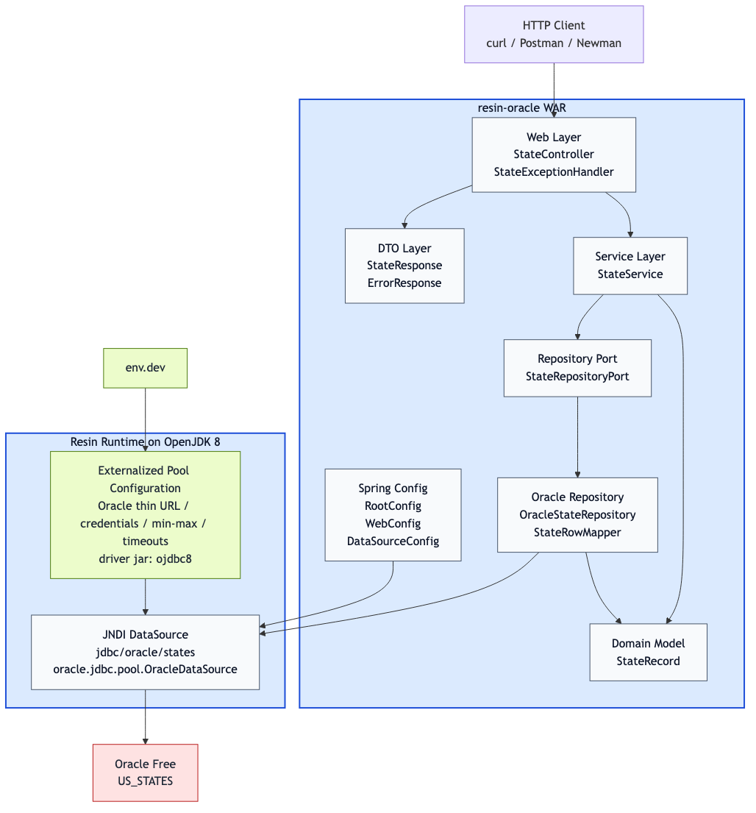
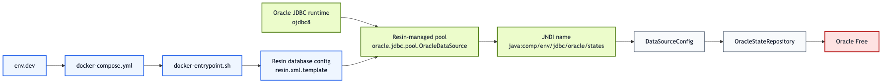

# Keep Connection Pool Configuration Out of Your Java App

*A small Java 8 service on Resin and Oracle Free used to illustrate a broader architectural point: application code should focus on business behavior, while the runtime owns datasource and pool configuration.*

Most Java developers have seen some version of this problem: a codebase starts simple, then slowly collects JDBC URLs, usernames, passwords, pool sizes, and timeout values in places that were supposed to contain application logic. Over time, connection-pool configuration stops being an operational concern and becomes part of day-to-day development.

Today, many companies build most of their new Java services with Spring Boot. That is the normal path now. But not every Java system runs that way, and not every team has fully moved away from application servers. For teams still deploying WARs to app servers, this separation is still directly relevant. For teams on Spring Boot, the underlying architectural lesson still holds: keep connection details and sensitive runtime configuration out of business code when you can.

This project is a deliberately small example of that approach.

It is a Java 8 WAR deployed to Resin, backed by Oracle Free, with a single endpoint:

- `GET /api/v1/states/{abbreviation}`

The point is not the endpoint itself. The point is the boundary around it.

## The problem this project is solving

One of the main goals here is to separate the concern of connection-pool configuration from the development of the application.

That means:

- Java developers should be able to work on controllers, services, DTOs, and repository logic without also editing pool settings.
- JDBC URLs, credentials, and tuning values should not be spread across Java classes or normal application configuration files.
- The application should depend on a `DataSource`, not on environment-specific connection details.

This is also a strategy for minimizing sensitive information in the codebase. If the code only knows a JNDI name, then usernames, passwords, hostnames, and pool settings do not need to be repeated throughout the repository.

This repo uses Resin and Oracle Free because that makes the runtime boundary very visible. But the article is really about the boundary itself, not just this exact stack.

## What the architecture looks like

At the application level, the code is split into familiar layers:

- `web` for request handling
- `dto` for API payloads
- `service` for orchestration and validation
- `repository` for Oracle access behind a port
- `domain` for internal model objects
- `config` for Spring wiring and JNDI lookup

That composition is shown here:



*Diagram 1: the code stays in normal Java layers, while the Resin runtime and Oracle dependency sit outside the WAR boundary.*

Related source:

- [application-layering.mmd](/Users/savanthongvanh/workspaces/resin-oracle/docs/architecture/application-layering.mmd)

## Where the real boundary lives

The more important diagram is not about packages. It is about ownership.

Who owns the connection details?
Who owns the pool?
Who owns the sensitive values?

In this project, the answer is not “the Java code.”



*Diagram 2: runtime values flow into Resin configuration, Resin creates the pooled datasource, and the application only consumes the JNDI-bound `DataSource`.*

Related source:

- [connection-ownership-flow.mmd](/Users/savanthongvanh/workspaces/resin-oracle/docs/architecture/connection-ownership-flow.mmd)
- [architecture notes](/Users/savanthongvanh/workspaces/resin-oracle/docs/architecture/README.md)

## How this repo demonstrates the idea

### 1. The application only knows a JNDI name

[DataSourceConfig.java](/Users/savanthongvanh/workspaces/resin-oracle/src/main/java/com/example/resinoracle/config/DataSourceConfig.java) looks up:

- `java:comp/env/jdbc/oracle/states`

That class does not define:

- JDBC URL
- database username
- database password
- pool min/max settings
- wait timeout
- idle timeout

That is the first part of the demonstration. The WAR is written against `DataSource`, not against environment-specific connection details.

### 2. Resin owns the datasource and the pool

The actual datasource definition is in [resin.xml.template](/Users/savanthongvanh/workspaces/resin-oracle/docker/resin/resin.xml.template).

That file shows that Resin configures:

- datasource implementation: `oracle.jdbc.pool.OracleDataSource`
- Oracle thin JDBC URL
- username and password
- pool settings such as min idle, max connections, idle time, and wait time

This matters because it keeps connection-pool configuration out of normal application development. A Java developer can change service logic without touching pool sizing. An operator can tune the pool without editing Java code.

### 3. Sensitive values come from the environment

The Resin template is populated by [docker-entrypoint.sh](/Users/savanthongvanh/workspaces/resin-oracle/docker/resin/docker-entrypoint.sh), using values from:

- `env.dev`
- `docker-compose.yml`

That is the second part of the demonstration. Sensitive values are not scattered across the codebase. They are kept in environment-driven runtime configuration instead of being baked into controllers, repositories, or Spring property files.

This does not eliminate secret management by itself, but it does improve the shape of the codebase:

- fewer places where credentials can leak
- less temptation to hardcode values during development
- clearer separation between application changes and environment changes

### 4. Repository code still looks normal

[OracleStateRepository.java](/Users/savanthongvanh/workspaces/resin-oracle/src/main/java/com/example/resinoracle/repository/oracle/OracleStateRepository.java) receives a `DataSource` and borrows a connection with try-with-resources.

That is important for Java developers reading this repo. Externalizing the pool does not make repository code strange. You still write straightforward JDBC access code, but the connection source is supplied by the container.

### 5. The Oracle JDBC implementation is explicit

The runtime dependency in [build.gradle](/Users/savanthongvanh/workspaces/resin-oracle/build.gradle) is:

- `com.oracle.database.jdbc:ojdbc8`

So the full path is:

- `ojdbc8` provides the Oracle JDBC implementation
- Resin configures `oracle.jdbc.pool.OracleDataSource`
- Resin pools it and binds it into JNDI
- application code looks up the JNDI `DataSource`
- repository code uses it

## Why this is useful for Java teams

If you mostly work in Spring Boot applications, this project is useful as a contrast. If you still run applications on app servers, it is more than a contrast; it is a directly relevant deployment model.

It shows a deployment style where:

- application logic stays inside the WAR
- datasource and pool behavior stay in the runtime
- connection-pool configuration is separated from application development
- sensitive connection details are minimized in the codebase
- changing environments does not require rewriting repository code

For Spring Boot readers, the takeaway is architectural. For app-server readers, it is architectural and operational.

That is the core lesson of the project.

The REST endpoint is small on purpose. The architectural boundary is the real subject.

One important caveat: this repository still contains both the application code and the app-server container build. That is fine for a demo, but if you want to push the separation of concerns further, a stronger approach is to keep the application in one repository and the app-server container build or runtime packaging in another. That makes the boundary even clearer: application teams ship the WAR, while platform or runtime concerns evolve separately.

## Running it locally

Start the stack:

```bash
docker compose --env-file env.dev up -d --build
```

Call the endpoint:

```bash
curl http://localhost:8080/api/v1/states/TX
```

If you want more detail after reading this article:

- [documentation.md](/Users/savanthongvanh/workspaces/resin-oracle/documentation.md)
- [specification.md](/Users/savanthongvanh/workspaces/resin-oracle/specification.md)
- [plans.md](/Users/savanthongvanh/workspaces/resin-oracle/plans.md)

## Summary

This project is a small example, but the lesson is larger than the endpoint it exposes.

The code demonstrates that a Java application does not need to own connection-pool configuration in order to use the database cleanly. The application can stay focused on web, service, and repository logic while the runtime owns JDBC URLs, credentials, datasource class selection, and pool tuning.

That separation improves maintainability, reduces coupling between development and operations, and helps minimize sensitive information in the codebase. Many teams may apply that lesson inside a Spring Boot platform in different ways. Teams still deploying to app servers can apply it very directly. In a production setup, you would usually strengthen that boundary even more by moving the app-server container build into a separate repository. If you want a simple way to show that direction to a Java team, this project is meant to be a concrete, readable example.
